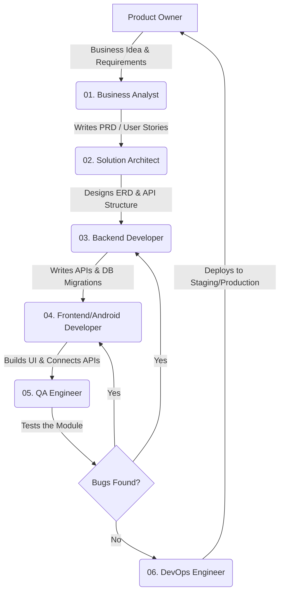

# AI Engineering Team Workflow Mapping
**Project:** RMG Woven Garments Traceability Software
**Prepared For:** Product Owner
**Document Purpose:** Defines the Software Development Life Cycle (SDLC) pipeline and team handover sequence.

---

## Team Handover Pipeline (টিমের কাজের সিকোয়েন্স)

নিচের ফ্লোচার্টটি (Flowchart) দেখাচ্ছে যে কোন টিমের কাজ শেষ হওয়ার পর সেটি কোন টিমের কাছে যাবে।

---

## Detailed Team Responsibilities per Module (মডিউল ভিত্তিক দায়িত্ব)

যখন আমরা কোনো নতুন মডিউল (যেমন: User Admin বা Cutting) নিয়ে কাজ শুরু করব, তখন নিচের সিকোয়েন্সে কাজ হবে:

### 1. Phase 1: Planning & Requirements
* **Product Owner (আপনি):** মডিউলে কী কী থাকতে হবে তার ইনস্ট্রাকশন দেবেন।
* **Business Analyst:** আপনার ইনস্ট্রাকশন শুনে একটি বিস্তারিত **PRD (Product Requirements Document)** লিখবে। এখানে Acceptance Criteria থাকবে।
* **Product Owner:** PRD পড়ে অ্যাপ্রুভ করবেন।

### 2. Phase 2: Architecture & Database
* **Solution Architect:** PRD অ্যাপ্রুভ হলে এই টিম কাজ শুরু করবে। তারা ডাটাবেসের টেবিল (ERD) ডিজাইন করবে এবং কোন কোন API লাগবে তার একটি লিস্ট তৈরি করবে।

### 3. Phase 3: Core Development
* **Backend Developer:** আর্কিটেক্টের ERD অনুযায়ী তারা Laravel-এ কোড করা শুরু করবে। ডাটাবেস মাইগ্রেশন রান করবে এবং ফ্রন্টএন্ডের জন্য API (JSON) তৈরি করবে।
* **Frontend / Android Developer:** ব্যাকএন্ডের API রেডি হলে এরা কাজ শুরু করবে। ট্যাবলেটের জন্য UI ডিজাইন করবে এবং API-এর সাথে কানেক্ট করে অফলাইন সিঙ্ক (Offline Sync) লজিক ইমপ্লিমেন্ট করবে।

### 4. Phase 4: Testing & Quality Assurance
* **QA Engineer:** ডেভেলপমেন্ট শেষ হলে QA টিম সিস্টেম টেস্ট করবে। তারা পজিটিভ এবং নেগেটিভ ডাটা দিয়ে চেক করবে যে সিস্টেম ক্র্যাশ করে কি না বা ভুল ডাটা নেয় কি না। কোনো এরর বা বাগ (Bug) পেলে তারা ডেভেলপারদের কাছে ফেরত পাঠাবে।

### 5. Phase 5: Deployment & Security
* **DevOps Engineer:** QA টিম সবুজ সংকেত দিলে ডেভঅপস টিম সেই মডিউলের কোডগুলোকে Docker-এর মাধ্যমে প্রোডাকশন সার্ভারে (Cloud/Local) ডেপ্লয় করে লাইভ করে দেবে।
* **Security & Database Engineer:** সিস্টেম লাইভ হওয়ার পর ব্যাকগ্রাউন্ডে কাজ করবে। ডাটাবেস স্লো হচ্ছে কি না বা সিস্টেমে কোনো হ্যাকিং লুপহোল আছে কি না তা চেক করবে।

---
**Agile Rule:** আমরা একবারে পুরো প্রজেক্টের কোড করব না। আমরা একটি মডিউল নেব, সেটিকে এই ৫টি ফেইজের (Phase) ভেতর দিয়ে পার করে লাইভ করব, তারপর ২য় মডিউলের কাজ ধরব।
