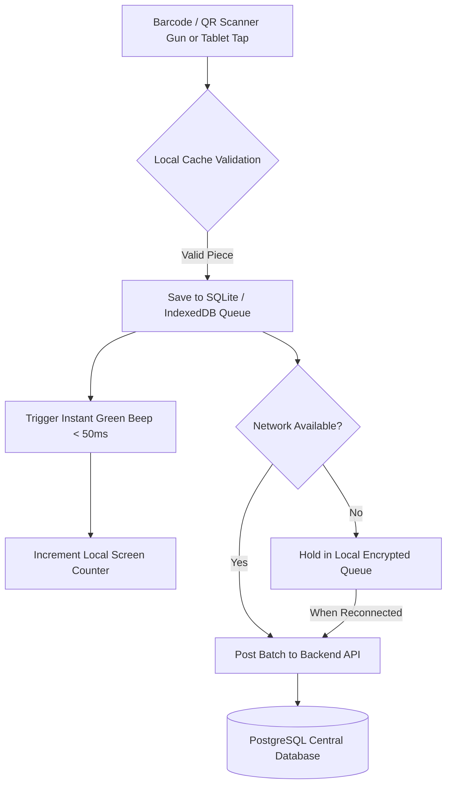

# Multi-Device UI/UX & Dashboard Architecture Specification
**প্রজেক্ট:** RMG Woven Garments Traceability Software  
**মডিউল:** Global Device UX Standards  
**লেখক:** Solution Architect & Lead Frontend Engineer  
**স্ট্যাটাস:** Approved for Development  

---

## ১. ভূমিকা ও লক্ষ্য (Objective)
একটি আরএমজি (RMG) গার্মেন্টস কারখানায় বিভিন্ন ধরনের ডিভাইসে ভিন্ন ভিন্ন ব্যবহারকারী কাজ করেন। মার্চেন্ডাইজার ও অ্যাডমিন কাজ করেন বড় স্ক্রিনের **Desktop/Web**-এ, ফ্লোর অপারেটররা কাজ করেন **10.1" Tablet**-এ, সুপারভাইজার ও জিএম নজর রাখেন **Mobile App**-এ, এবং স্টোর/প্যাকিং কর্মীরা ব্যবহার করেন **Industrial Handheld PDA / Scanner**।

এই ডকুমেন্টে প্রতিটি ডিভাইসের জন্য **আলাদা UI/UX আর্কিটেকচার, ড্যাশবোর্ড লেআউট, ইনপুট মেথডোলজি এবং রেসপনসিভ আচরণ** বিস্তারিতভাবে সংজ্ঞায়িত করা হলো।

---

## ২. ডিভাইস ফর্ম-ফ্যাক্টর তুলনা ম্যাট্রিক্স (Comparison Matrix)

| প্যারামিটার | ১. Desktop / Web | ২. Factory Floor Tablet (10.1") | ৩. Supervisor Mobile | ৪. Industrial PDA / Gun Scanner |
|---|---|---|---|---|
| **মূল ব্যবহারকারী** | Admin, Merchandiser, IE Planner, Accounts | Line Supervisor, QC Inspector, Finishing Lead | Production Manager, GM, Floor Incharge | Fabric Warehouse, Cutting Store, Carton Packing |
| **স্ক্রিন সাইজ** | 14" – 27" (1920x1080+) | 8" – 10.1" Landscape (1280x800) | 6.1" – 6.7" Portrait (390x844) | 4.0" – 5.5" Rugged Screen (720x1440) |
| **ইনপুট মেথড** | Mouse, Keyboard, Trackpad | Multi-Touch (Glove friendly), Stylus | Thumb Touch, Gesture (Swipe) | Hardware Laser Trigger, Physical Keypad |
| **অথেন্টিকেশন** | Email + Password + 2FA | **৬-ডিজিট ফাস্ট পিন কোড (PIN)** | Biometric (Fingerprint/FaceID) / Token | **অটো-লকড ফিক্সড ডিভাইস টোকেন (1-Year)** |
| **থিম প্রিফারেন্স** | Light SaaS / Clean Slate | **High-Contrast Dark Mode (Factory Floor)** | Adaptive (System Light/Dark) | Ultra High-Contrast Mono/Dark |
| **অফলাইন সাপোর্ট** | Standard Caching (Service Worker) | **Strict Offline-First (IndexedDB / SQLite)** | Read Cache & Background Sync | **Strict Offline Local Queue** |
| **অডিও/হ্যাপটিক** | দরকার নেই | **লাউড বিপ (Success: 1 Beep, Error: 3 Buzzer)** | হ্যাপটিক ভাইব্রেশন ও পুশ নোটিফিকেশন | হার্ডওয়্যার এলইডি + ভাইব্রেটর + বিপার |

---

## ৩. ডিভাইস অনুযায়ী বিস্তারিত UI/UX ও ড্যাশবোর্ড স্পেসিফিকেশন

---

### 💻 ৩.১. Desktop / Web Application (Admin & Management Hub)

#### ক. উদ্দেশ্য ও ব্যবহার
মার্চেন্ডাইজিং (PO, Style, Breakdown), প্রোডাকশন প্ল্যানিং (BOM, SMV, Routing), সিস্টেম অ্যাডমিন (Users, Roles, Devices) এবং এক্সিকিউটিভ বিজনেস ইন্টেলিজেন্স (BI Analytics)।

#### খ. ড্যাশবোর্ড ও লেআউট বৈশিষ্ট্য
1. **Multi-Tier Navigation Sidebar:**
   - বামপাশে কলাপসিবল সাইডবার (আইকন + মডিউল নেম + ব্যাজ কাউন্ট)।
   - ড্রপডাউন সাব-মেনু (যেমন: Master Data -> Buyers, Styles, Lines, Colors/Sizes)।
2. **Dense Data Tables with Advanced Filtering:**
   - প্রতি পৃষ্ঠায় ১৫, ৫০, ১০০ সারি দেখার সুবিধা।
   - মাল্টি-কলাম সার্চ, বায়ার/স্টাইল ফিল্টার, কলাম সর্টিং ও এক্সপোর্ট বাটন (CSV/Excel/PDF)।
3. **Multi-Column Modals & Forms:**
   - টু-কলাম গ্রিড লেআউট, ফর্ম ভ্যালিডেশন এরর মেসেজ, অটো-কমপ্লিট ড্রপডাউন।
4. **Rich Analytics Widgets:**
   - Recharts / ApexCharts ভিত্তিক লাইন গ্রাফ (Hourly Production Trend), বার চার্ট (DHU by Defect Type), পাই চার্ট (Order Status Breakdown)।

```text
+-----------------------------------------------------------------------------------+
|  [Logo] RMG Traceability ERP      [Search...]        [Live Floor: Online] [User v] |
+------------------+----------------------------------------------------------------+
|  Sidebar         |  Dashboard / Active Page Area                                  |
|  - Dashboard     |  +--------------------+ +--------------------+ +--------------+ |
|  - Master Data   |  | Total Orders: 1.2M | | Sewing Output: 8.4k| | Avg DHU: 1.2%| |
|  - Order (PO)    |  +--------------------+ +--------------------+ +--------------+ |
|  - Cutting       |  +------------------------------------------------------------+ |
|  - Sewing        |  | Master Data Table (Filters, Search, Bulk Actions, Export)  | |
|  - QC Matrix     |  | [Select] [Buyer] [Style No] [Qty] [Target] [Status] [Act]  | |
|  - Packing       |  +------------------------------------------------------------+ |
|  - Admin & Roles |                                                                |
+------------------+----------------------------------------------------------------+
```

---

### 📱 ৩.২. Factory Floor Tablet UI (Sewing & QC Floor)

#### ক. উদ্দেশ্য ও ব্যবহার
সুইং লাইনের শুরুতে বান্ডল ইনপুট স্ক্যান, লাইনের শেষে আউটপুট স্ক্যান, এবং QC টেবিলে ১-পিস সিঙ্গেল গার্মেন্ট কিউআর কোড স্ক্যান করে ডিফেক্ট ট্যাগিং।

#### খ. স্পেশাল ফ্লোর UX নিয়মাবলী
1. **Full-Screen Kiosk Mode:** ব্রাউজার ইউআরএল বার বা ব্যাক বাটন থাকবে না। অ্যাপ ফুল-স্ক্রিনে লক থাকবে।
2. **Fast Numeric PIN Login:** লাইনের শুরুতে সুপারভাইজার মাত্র **৬-ডিজিট পিন** দিয়ে ১ সেকেন্ডে লগইন করবেন।
3. **Massive Touch Targets (৬৪px - ৮০px):**
   - অপারেটররা সাধারণত গ্লাভস বা আঙুলে টেপ পরে কাজ করেন, তাই সব বাটন বড় ও স্পষ্ট হতে হবে।
4. **Interactive SVG Garment Body Map (QC এর জন্য):**
   - টি-শার্ট / শার্ট / প্যান্টের ভেক্টর ড্রয়িং থাকবে। কোনো ডিফেক্ট পেলে (যেমন: Skip Stitch) বডি ম্যাপের নির্দিষ্ট পয়েন্টে (যেমন: Collar বা Armhole) ১-ক্লিকে ডিফেক্ট ট্যাগ করা যাবে।
5. **Continuous Scanner Focus:**
   - ব্লুটুথ বা ইউএসবি বারকোড স্ক্যানার দিয়ে স্ক্যান করার পর ফোকাস স্বয়ংক্রিয়ভাবে ইনপুট ফিল্ডে ফিরে আসবে (No manual tap required)।
6. **Audio & Visual Feedback:**
   - **Green Screen Flash + High Beep:** Successful Scan (Pass).
   - **Red Screen Flash + Low Triple Buzzer:** Defect / Duplicate Scan / Wrong Line Alert.

```text
+-----------------------------------------------------------------------------------+
| [Line 04 - Sewing]   Target: 120/hr | Current: 98 | Efficiency: 81.6%   [Logout PIN] |
+-----------------------------------------------------------------------------------+
|  SCAN INPUT ACTIVE:  [ |||||||||||||||| QR Code Ready |||||||||||||||| ]          |
+------------------------------------------+----------------------------------------+
|  LAST SCANNED PIECE                      |  QUICK ACTION / DEFECT BUTTONS         |
|  - Style: Levi-501-Denim                 |  [  PASS (Green - 80px)  ]             |
|  - Bundle: #B-8842 (Size: 32, Col: Blue) |  [  REWORK / ALTER (Amber) ]           |
|  - Piece: #07 of 20                      |  [  REJECT / SCRAP (Red)   ]           |
|  - Operator: Rahim (ID: 1042)            |  [  BODY DEFECT MAP TAP    ]           |
+------------------------------------------+----------------------------------------+
|  [ Recent 10 Scans Real-time List (Latest on top with green tick) ]               |
+-----------------------------------------------------------------------------------+
```

---

### 📲 ৩.৩. Supervisor / Manager Mobile App (Android / iOS)

#### ক. উদ্দেশ্য ও ব্যবহার
ফ্যাক্টরি ফ্লোরে হাঁটার সময় লাইন পারফরম্যান্স পর্যবেক্ষণ, বটলনেক নোটিফিকেশন গ্রহণ এবং যেকোনো জায়গায় বসে জরুরি অর্ডার/এক্স-ফ্যাক্টরি অনুমোদন।

#### খ. মোবাইল UX বৈশিষ্ট্য
1. **Bottom Navigation Bar:**
   - ৪টি মূল ট্যাব: `Dashboard`, `Floor Lines`, `Alerts`, `Profile`।
2. **Thumb-Friendly One-Hand Usability:**
   - সমস্ত গুরুত্বপূর্ণ অ্যাকশন স্ক্রিনের নিচের অর্ধেক অংশে থাকবে।
3. **Pull-to-Refresh & Live Push Alerts:**
   - কোনো লাইনের DHU ৩% অতিক্রম করলে বা লাইনে ২০ মিনিট স্ক্যান বন্ধ থাকলে পুশ অ্যালার্ট।
4. **Camera Barcode/QR Audit Scanner:**
   - ফ্লোরে দাঁড়িয়ে যেকোনো গার্মেন্ট বা কার্টুন কিউআর কোড ফোনের ক্যামেরা দিয়ে স্ক্যান করে সম্পূর্ণ লাইফসাইকেল হিস্ট্রি (Traceability Tree) দেখা যাবে।

```text
+------------------------------+
| RMG Factory Alert       (4)  |
+------------------------------+
| LINE 02 (DHU ALERT: 4.8%)    |
| Style: ZARA-Woven-04         |
| Bottleneck: Collar Joint     |
| [View Body Map] [Fix Action] |
+------------------------------+
| FACTORY LIVE SUMMARY         |
| - Total Production: 34,200   |
| - Running Lines: 12 / 12     |
| - Top Line: Line 07 (94%)    |
+------------------------------+
| QUICK ACTIONS                |
| [ Camera QR Scan ]           |
| [ Approve Gate Pass ]        |
+------------------------------+
| [Home] [Lines] [Alerts] [Menu]|
+------------------------------+
```

---

### 🔫 ৩.৪. Industrial Handheld PDA / Gun Scanner (Zebra / Honeywell / Urovo)

#### ক. উদ্দেশ্য ও ব্যবহার
ফ্যাব্রিক ওয়্যারহাউস রিসিভিং (GRN), কাটিং থেকে বান্ডল রিলিজ, ফিনিশিং ওয়াশিং ব্যাচিং, এবং কার্টুন প্যাকিং ও কন্টেইনার স্টাফিং।

#### খ. PDA Scanner UX বৈশিষ্ট্য
1. **Hardware Keyboard Wedge / Intent Broadcast Mode:**
   - স্ক্রিনে কোনো টাইপিং করতে হবে না; ফিজিক্যাল গান ট্রিগার চাপলেই ডেটা স্বয়ংক্রিয়ভাবে এন্টার হবে (Latency < 50ms)।
2. **Minimalist Ultra-High Contrast UI:**
   - শুধু ৩টি তথ্য বড় ফন্টে দেখাবে:
     - **কার্টুন নম্বর ও ক্যাপাসিটি:** (e.g. `CTN-9021: 18/24 Pcs`)
     - **স্ক্যান কাউন্টার:** (e.g. `TOTAL PACKED: 450 Pcs`)
     - **স্ট্যাটাস ইন্ডিকেটর:** (e.g. `MATCHED: L-Blue-32` বা `MISMATCH COLOR!`)
3. **Double Scan & Cross-Order Lockout:**
   - একই পিস দুইবার স্ক্যান করলে সাথে সাথে ভাইব্রেশন ও রেড অ্যালার্ট দিয়ে পরবর্তী স্ক্যান ব্লক করবে।

```text
+------------------------------+
| CARTON PACKING: CTN-4091     |
| Order: H&M-Tee-2026 (Size: M)|
+------------------------------+
|                              |
|           21 / 24            |
|       PIECES PACKED          |
|                              |
+------------------------------+
| LAST: PC-8842-19 [VALID OK]  |
| Color: Vintage Navy          |
+------------------------------+
| [  COMPLETE CARTON & SEAL  ] |
+------------------------------+
```

---

## ৪. অফলাইন-ফার্স্ট এবং ডাটা সিঙ্ক স্ট্র্যাটেজি (Offline-First Architecture)

ফ্যাক্টরি ফ্লোরে অনেক সময় ওয়াই-ফাই নেটওয়ার্ক ড্রপ করতে পারে। প্রডাকশন যাতে ১ সেকেন্ডের জন্যও বন্ধ না হয়, তার জন্য নিচের আর্কিটেকচার কার্যকর থাকবে:



---

## ৫. ডিরেক্টরি ও কম্পোনেন্ট অর্গানাইজেশন (Frontend Code Structure)

```text
frontend/src/
├── features/
│   ├── dashboard/                  # Desktop Executive Web Dashboard
│   ├── floor-tablet/               # Tablet Specific Fullscreen Kiosk UI
│   │   ├── pages/
│   │   │   ├── SewingLineScanPage.jsx
│   │   │   ├── QcInspectionBodyMapPage.jsx
│   │   │   └── TabletPinLockScreen.jsx
│   │   └── components/
│   │       ├── SvgGarmentBodyMap.jsx
│   │       ├── MassiveTouchButton.jsx
│   │       └── AudioBuzzerFeedback.jsx
│   ├── mobile/                     # Mobile-Optimized Responsive Views
│   │   ├── pages/MobileSupervisorDashboard.jsx
│   │   └── components/MobileBottomNav.jsx
│   └── pda-scanner/                # Industrial Gun Scanner Minimal UI
│       ├── pages/CartonPackingGunPage.jsx
│       └── hooks/useHardwareScanner.js
```

---

## ৫.১. ডিজাইন টোকেন ও কর্নার রেডিয়াস স্ট্যান্ডার্ড (Strict Industrial Tokens)

এন্টারপ্রাইজ আরএমজি সফটওয়্যারে প্রফেশনাল, শার্প ও ইন্ডাস্ট্রিয়াল লুক বজায় রাখার জন্য কর্নার রেডিয়াসের নিচের স্ট্যান্ডার্ড **বাধ্যতামূলকভাবে** অনুসরণ করতে হবে:

| এলিমেন্ট টাইপ | কর্নার রেডিয়াস টোকেন | পিক্সেল সাইজ | প্রয়োগ ক্ষেত্র |
|---|---|---|---|
| **Buttons & Badges** | `rounded` / `rounded-md` | 4px – 6px | প্রাইমারি বাটন, ফিল্টার ড্রপডাউন, স্ট্যাটাস ব্যাজ, ছোট আইকন বক্স |
| **KPI & Dashboard Cards** | `rounded-md` | 6px | ড্যাশবোর্ড কার্ড, কেপিআই উইজেট, স্প্রিন্ট ব্লক |
| **Containers & Tables** | `rounded-md` / `rounded-lg` | 6px – 8px | মাস্টার ডাটা টেবিল, পপআপ মোডাল, মেইন ব্যানার কন্টেইনার |
| **Tablet Touch Buttons** | `rounded-xl` | 12px | ফ্যাক্টরি ফ্লোর কিওস্কের টাচ বাটন |
| **🚫 Strictly Prohibited** | `rounded-xl`, `rounded-2xl`, `rounded-3xl` | 12px – 32px | ওয়েবের কোনো সাধারণ কার্ড বা ব্যানারে বড় গোল কর্নার দেওয়া সম্পূর্ণ নিষিদ্ধ |

---

## ৬. সারসংক্ষেপ ও পরবর্তী পদক্ষেপ
এই স্পেসিফিকেশন অনুযায়ী প্রতিটি মডিউলের ফ্রন্টএন্ড UI ডেভেলপ করার সময় সংশ্লিষ্ট ডিভাইসের স্ক্রিন সাইজ, ইনপুট মোড এবং অপারেটর সুবিধার কথা বিবেচনা করে কোড লেখা হবে।
